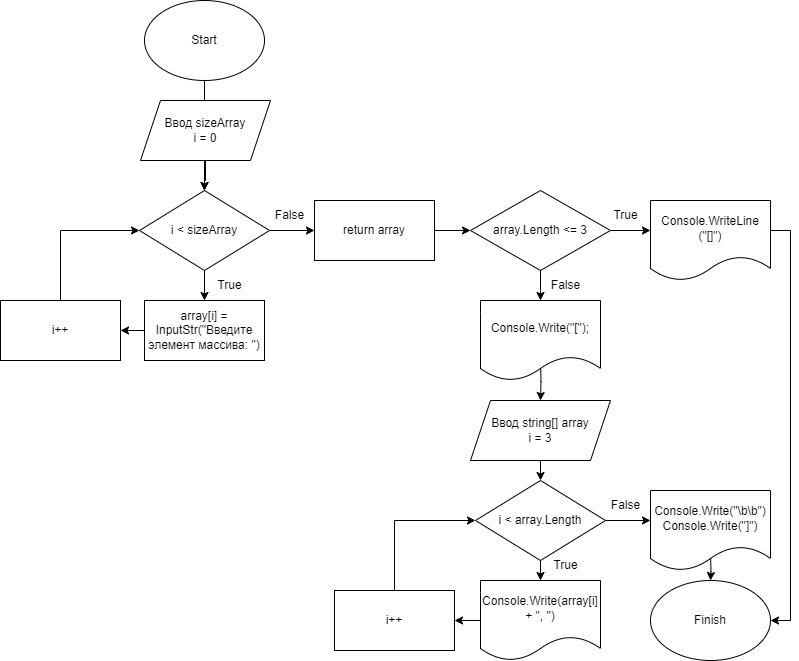

# Контрольная задача:

Написать программу, которая из имеющегося массива строк формирует новый массив из строк, длина которых меньше, либо равна 3 символам. Первоначальный массив можно ввести с клавиатуры, либо задать на старте выполнения алгоритма. При решении не рекомендуется пользоваться коллекциями, лучше обойтись исключительно массивами.

## Описание решения задачи:

1. Создаем метод для ввода с клавиатуры строки и возвращаем строку.

2. Создаем метод для ввода с клавиатуры строки и возвращаем число.

3. Создаем метод для заполнения массива элементами, используя первый метод и второй, чтобы задать длину массива.

4. Создаем метод решения задачи с двумя **условиями**:
* ***Если:*** длина массива <= 3, то в выводе будет пустой массив.
* ***Иначе:*** выводим элементы массива, начиная с 4 элемента.

## Блок-схема алгоритма:

